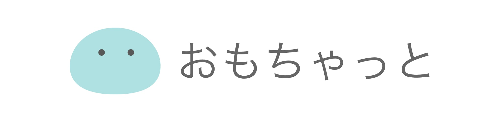
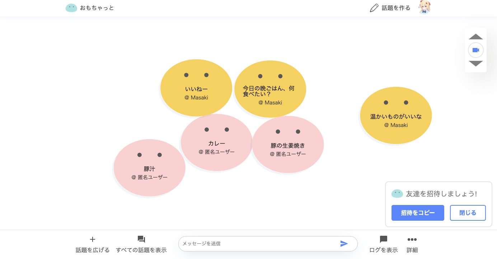

# おもちゃっと

## URL
https://omochat.app/

## なにができる？

『おもちゃっと』は、チャットアプリの一つです。  
しかし、他のチャットアプリとは異なり、メッセージは単なるテキストではなく、キャラクターとして出現します。  
「コミュニケーションをもっと面白く」をコンセプトに作成されたこのアプリを使えば、会議、アイデア出しの場を更に盛り上げることができます。

# 使用技術
- フロントエンド
  - Typescript
  - NextJS
  - React
  - 状態管理(Redux)
  - セッション管理(Firebase Auth)
  - ソーシャルログイン(Firebase Auth)
  - データベース(Firestore, Firebase Realtime Database)
  - 非同期データ処理(RxJS)
  - リンター(ESLint)
- バックエンド
  - Go
    - セッション管理(gorilla/sessions)
    - APIサーバー(gin)
    - OAuth
- Google Cloud Platform
  - Google App Engine
  - Google Cloud Functions
  - Google Cloud Storage
  - Firebase
- Circle CI

# 設計
## GCP構成図
アプリケーションは`Google App Engine`上で動作しています。   
また、マイクロサービスを意識して、『招待コード管理』や『おすすめ話題の作成』はアプリケーションから切り離し、`Cloud Functions`上で動作させています。  
CI/CDの一環として、GitHubにコミットされたコードはテストされた後、自動的にデプロイされるようになっています。

## コード設計
クリーンアーキテクチャをベースとし、実装に直接依存しないような設計にしています。  
これにより全ての要素は交換可能になり、テストの実装や、機能追加が簡単になりました。  
また、クリーンアーキテクチャほど厳密に設計すると要素数が多くなってしまうので、ドメイン駆動設計の概念も取り入れて実装しやすい形にしました。  

# 機能一覧
## 基本機能
- ### ユーザー登録・ログイン  
  Googleアカウントを使ってログインすることができ、ユーザー名やアイコンは自由に変更することが可能です。  
  また、５日間はログイン状態が保持されます。

- ### 『話題』作成機能  
  新規に『話題』と呼ばれるメッセージをやり取りする場所を作成できます。

- ### リアルタイムメッセージング
  入力されたメッセージはリアルタイムで他のユーザーにも表示されます。  
  リアルタイムかつ頻繁な書き込みが可能とするため`Firestore Realtime Database`を利用しています。

- ### プロフィール　　
  プロフィールページではユーザーが作成した話題の一覧を見ることができます。  
  また、ユーザーのプロフィールはGoogleアカウントを元に作成されますが、表示名やプロフィール画像を編集することが可能です。
  

- ### SSR・ISR
  描画速度の向上のため、ほぼ全てのページにおいて`Server Side Rendering`を利用しています。  
  また、トップページは全てのページから参照され、高速に表示されることが求められるため`Incremental Static Regeneration`を使用して、最新のキャッシュを受け取れるようにしています。  
  これらは全て`NextJS`の機能を利用して実装しています。

- ### ページネーション機能
  話題一覧ページでは、ユーザーが話題をいち早く見つけられるようにするために、無限スクロールができるようになっています。  
  この機能を実現するために、ページネーションが行われています。

## UX向上のための機能
- ### レスポンシブ対応
  モバイル・タブレット端末で閲覧したときの操作性を向上させるため、表示方法を変えています。
  

- ### サムネイルの自動作成  
  サムネイルは入力された情報を元に**リアルタイムで自動作成**されます。  
  サムネイルは自分で指定することもでき、`Google Cloud Storage`に保存されます。
  

- ### カメラ機能
  メッセージがキャラクターとして表示されるので、メッセージの数が増えると表示数を調整しても見えにくくなってしまいます。　これを解決するため、カメラ機能を提供することで、キャラクターの数が増えても他のチャットアプリと同様に縦スクロールで見ることができるようになりました。　
  

- ### おすすめの話題抽出
  ユーザーが素早く会話に参加できるように、トップページにおすすめの話題一覧を作成しています。  
  バックエンドサーバーが定期的におすすめの話題をメッセージの件数、投稿日を考慮して自動作成します。
- ### 秘密の話題  
  招待コードもしくはURLを知っているユーザーのみが参加できる『話題』を作成することができます。  
  この話題はトップページや話題一覧には表示されず、プロフィールページにて作成者だけが閲覧することができます。
  
- ### 招待コード  
  ユーザーはページリンクまたは、招待コードから参加が可能です。
  
  
  
  招待コードやページリンクを含む『招待』をコピーして、友人に参加してもらうことができます。

  

- ### 話題を広げる
  会話が弾むと、最初の話題から全く別の話題に変化することがあります。  
  話題を新たに作成することも可能ですが、『**話題を広げる**』という機能を使えば、同じページにいながら、新しい話題を作ることができます。
  

